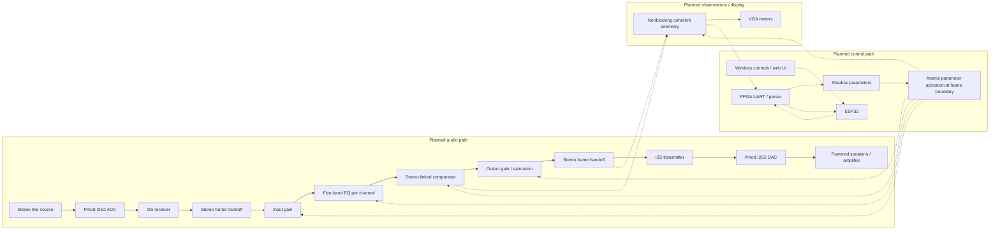

# ANIMA

**Artix Networked I2S Multiband Audio Processor**

A planned stereo audio processor for the Basys 3 Artix-7 FPGA and Pmod I2S2, with ESP32 wireless controls. Target: 48 kHz, 24-bit stereo samples in 32-bit I2S slots. Wi-Fi carries control traffic only.

**Status:** scaffold only. No audio RTL, firmware, board constraints, synthesis target, simulation target, or hardware validation exists yet. First milestone: stereo bypass without DSP.

## Planned system

Solid arrows carry audio; dashed arrows carry control or observations. Frame handoffs do not select buffering or clock topology.



## Repository layout

| Path | Purpose |
| --- | --- |
| [rtl/](rtl/README.md) | Verilog audio, DSP, control and display blocks |
| [model/](model/README.md) | Floating-point and bit-exact reference models |
| [sim/](sim/README.md) | Testbenches, scoreboards and vectors |
| [firmware/esp32/](firmware/esp32/README.md) | ESP32 controls and web interface |
| [tools/serial_host/](tools/serial_host/README.md) | PC UART diagnostics |
| [hardware/](hardware/BOM.md) | Bill of materials |
| [docs/](docs/README.md) | System contracts, ownership and references |
| [scripts/](scripts/README.md) | Repository checks and build tooling |
| [results/](results/README.md) | Measurement and release evidence |

## Available checks

With Python 3.12:

```sh
python scripts/check_repo.py
```

This checks documentation links, encoding, formatting and scaffold integrity; it does not validate audio or FPGA timing. No executable simulation target exists yet.

Start with [architecture](docs/architecture.md), [ownership](docs/ownership.md), [development](docs/development.md) and [sources](docs/sources.md). The [documentation index](docs/README.md) links the remaining contracts and plans.
