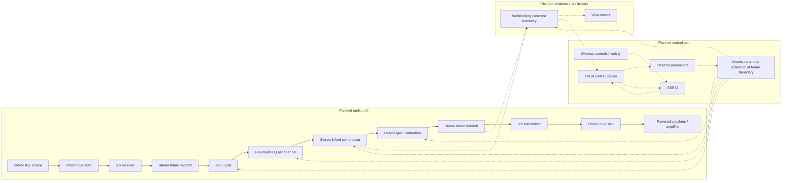

# ANIMA

**Artix Networked I2S Multiband Audio Processor**

A stereo audio processor on the Basys 3 Artix-7 FPGA, with ESP32 wireless control.

**Status:** repository scaffold. Audio RTL, firmware, board constraints, and hardware validation are not implemented yet.

## Planned system

**Planned architecture; not implemented or hardware validated.** Solid arrows carry audio; dashed arrows carry control or observations. Frame handoffs do not specify a FIFO or clock-domain crossing implementation.



Clock ownership, domain topology, reset sequencing, frame handshakes, buffering, pins, and control interfaces remain design decisions. The first implementation milestone is stereo bypass without DSP. See the [architecture and next design gate](docs/architecture.md) and [shared source register](docs/sources.md).

Target: 48 kHz, 24-bit stereo samples in 32-bit I2S slots. The planned FPGA will process audio; the ESP32 will host controls and send parameter updates over UART. Wi-Fi carries control traffic only. VGA meters and an ESP32 web interface follow the working audio core.

## Repository layout

| Path | Purpose |
| --- | --- |
| [rtl/](rtl/README.md) | Synthesizable Verilog (.v): audio, DSP, control, display, common blocks |
| [model/](model/README.md) | Floating-point reference and bit-exact fixed-point models |
| [sim/](sim/README.md) | Verification in Verilog or SystemVerilog, scoreboards, test vectors |
| [firmware/esp32/](firmware/esp32/README.md) | ESP32 control firmware and web interface |
| [tools/serial_host/](tools/serial_host/README.md) | PC serial control and protocol diagnostics |
| [hardware/](hardware/BOM.md) | Bill of materials |
| [docs/](docs/README.md) | Architecture, ownership, roadmap, interface contracts, verification |
| [scripts/](scripts/README.md) | Repository checks and future reproducible build scripts |
| [results/](results/README.md) | Measurement summaries and release evidence |

## Start here

1. Read the [work split](docs/ownership.md) and [roadmap](docs/roadmap.md).
2. Follow the [development workflow](docs/development.md).
3. Agree on [control protocol](docs/protocol.md), [numeric formats](docs/numerics.md), and clock ownership before writing their consumers.
4. Build a stereo bypass path and independent UART identity/status exchange before integrating DSP controls.

Run the available repository check with Python 3.12:

```sh
python scripts/check_repo.py
```

CI currently checks documentation links and scaffold integrity; it does not prove FPGA synthesis, audio correctness, or timing.
